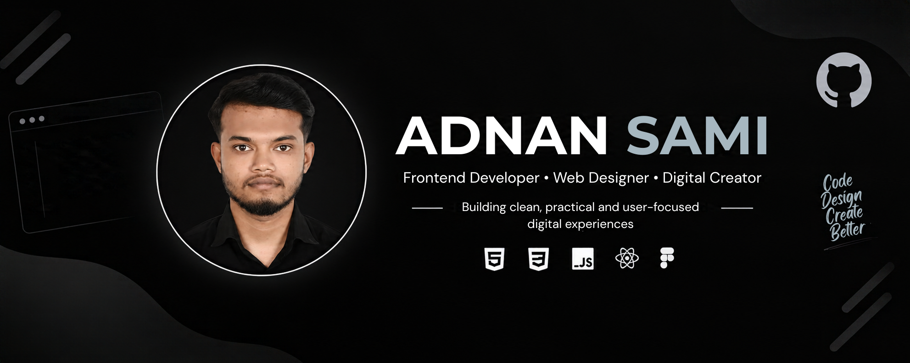

 

# 👋 Hi, I'm Adnan Sami

### Frontend Developer • Web Designer • Digital Creator

**You may know me online as `adnanzeros`.**

Building clean, practical, and user-focused digital experiences from **Dhaka, Bangladesh 🇧🇩**

 

---

## 💬 Personal Quote

### *“Doing something is better than doing nothing.”*

**— `adnanzeros`**

 

🌐 View Translations

 

🇬🇧 **English**

> “Doing something is better than doing nothing.”

🇧🇩 **বাংলা**

> “কিছু না করার থেকে কিছু করা ভালো।”

🇪🇸 **Español**

> “Hacer algo es mejor que no hacer nada.”

🇨🇳 **中文**

> “做点什么总比什么都不做要好。”

---

## 👨‍💻 About Me

I'm a **Frontend Developer and Web Designer** focused on turning ideas into practical and user-friendly digital experiences.

I work across **frontend development, UI design, WordPress, and modern web technologies**. I enjoy learning through real-world projects, experimenting with new tools, and continuously improving my skills.

### What I Do

* 💻 Build responsive websites and web applications
* 🎨 Design clean and modern user interfaces
* ⚛️ Develop projects with React and modern frontend tools
* 🧩 Create useful Chrome Extensions and digital tools
* 🌐 Work with modern hosting and deployment platforms
* 🛠️ Explore practical solutions to real-world problems
* 📚 Continuously learn and experiment with new technologies

---

## 🚀 Currently Working On

* 🌐 Modern websites and web applications
* ⚛️ React and advanced frontend development
* 🧩 Chrome Extensions and browser-based tools
* 🎨 UI/UX design and digital experiences
* ☁️ Modern deployment and cloud technologies
* 💡 Turning practical ideas into real-world digital products

---

# 🛠️ Tech Stack

## 🌐 Languages & Web Technologies

---

## ⚛️ Frameworks & Libraries

---

## ☁️ Cloud, Hosting & Services

---

## 💻 Programming & Development Tools

---

## 🔧 Version Control

---

## 🎨 Design & Creative Tools

---

# 📌 Featured Projects

## 🌐 Shuru Kori Online

A practical learning and guidance platform focused on helping learners build skills through **live sessions, practical work, and direct guidance**.

**Focus:** Web Development • Learning Platform • Digital Products

🌐 **Website:** https://shurukori.online/

---

## 🚀 DevStack

A React-based technology stack builder that allows users to explore technologies and create their own development stack.

**Tech:** React • JavaScript • CSS • Vite • React Toastify

🌐 **Live Demo:** https://sparkling-chaja-0c0966.netlify.app/

💻 **Repository:** https://github.com/adnanzeros/Assignment-5

---

## 🧩 Chrome Extensions

Developing practical browser extensions designed to improve productivity and solve everyday digital problems.

**Tech:** HTML • CSS • JavaScript • Chrome Extension APIs

---

# 📊 GitHub Statistics

---

# 🎯 Current Learning Journey

| Area        | Current Focus                       |
| ----------- | ----------------------------------- |
| ⚛️ Frontend | React • JavaScript • Next.js        |
| 🎨 Design   | UI/UX • Figma • Canva               |
| 🌐 Web      | Responsive & Modern Web Development |
| ☁️ Cloud    | Vercel • Netlify • Firebase         |
| 🧩 Tools    | Chrome Extensions                   |
| 🐙 Git      | Git & GitHub Workflow               |
| 🚀 Projects | Real-World Digital Products         |

---

# 📚 Currently Exploring

---

# 💡 Development Philosophy

### **Build → Learn → Experiment → Improve → Repeat**

I believe the most effective way to learn technology is by **building real projects, solving real problems, experimenting with new ideas, and continuously improving**.

---

# 🤝 Let's Connect

<!--  -->

<!--  -->

<!--  -->

---

### ⭐ Thanks for visiting my profile!

**Let's build something useful together.**

